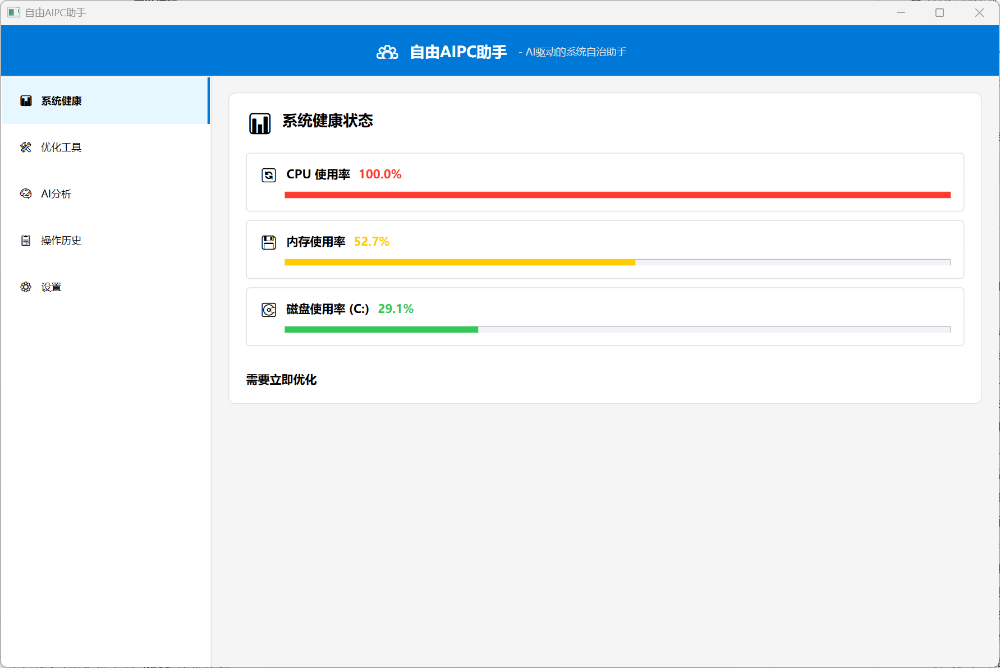

# 自由AIPC助手



自由AIPC助手是一款AI驱动的系统自治助手，旨在帮助用户监控系统健康状态、优化系统性能、提供智能分析和建议，以及管理系统操作。

## 功能特性

### 📊 系统健康状态
- 实时监控CPU使用率
- 内存使用情况分析
- 磁盘空间使用监控
- 系统健康状态评估

### 🛠️ 优化工具
- **缓存清理**：清理系统和应用缓存，释放磁盘空间
- **系统优化**：优化启动项和服务，提升系统速度
- **软件卸载**：卸载不需要的软件，释放系统资源
- **内存释放**：释放未使用的内存，提升系统响应速度

### 🧠 AI分析
- 智能系统状态分析
- 基于Ollama模型的AI建议
- 实时系统性能评估
- 个性化优化建议

### 📋 操作历史
- 详细记录系统操作历史
- 操作状态跟踪
- 历史记录查询

### ⚙️ 设置管理
- Ollama API地址配置
- AI模型选择与管理
- 系统分析自动执行设置
- 优化建议通知设置

## 技术栈

- **开发框架**：WPF (.NET 8.0)
- **UI框架**：XAML
- **MVVM框架**：CommunityToolkit.Mvvm
- **依赖注入**：Microsoft.Extensions.DependencyInjection
- **日志系统**：Serilog
- **HTTP客户端**：System.Net.Http
- **JSON处理**：System.Text.Json
- **系统管理**：System.Management, System.ServiceProcess

## 安装指南

### 前提条件
- Windows 10/11 操作系统
- .NET 8.0 运行时
- Ollama 服务（用于AI分析功能）

### 安装步骤
1. 从发布页面下载最新版本的安装包
2. 运行安装程序并按照提示完成安装
3. 启动应用程序，在设置页面配置Ollama API地址
4. 点击"刷新"按钮获取可用的AI模型
5. 选择默认模型并保存设置

### 从源码构建
1. 克隆代码仓库：`git clone <仓库地址>`
2. 打开项目：`cd ai_PC && dotnet build`
3. 运行应用：`dotnet run`

## 使用说明

### 系统健康状态
- 查看CPU、内存、磁盘的实时使用情况
- 系统会自动评估健康状态并显示相应信息

### 优化工具
- 点击相应工具卡片上的按钮执行优化操作
- 操作过程中会显示进度信息
- 操作完成后会在操作历史中记录

### AI分析
- 系统会自动分析系统状态并生成AI建议
- 可以点击"一键执行"按钮执行建议的操作
- 也可以选择"忽略"不需要的建议

### 操作历史
- 查看所有系统操作的历史记录
- 包括操作时间、类型、状态和详细信息

### 设置管理
- 配置Ollama API地址以连接到AI服务
- 选择合适的AI模型用于分析
- 开启或关闭自动系统分析功能
- 开启或关闭优化建议通知

## 项目结构

```
ai_PC/
├── Models/              # 数据模型
│   ├── AppSettings.cs   # 应用设置模型
│   ├── OperationHistory.cs # 操作历史模型
│   └── SharedTypes.cs   # 共享类型定义
├── Services/            # 服务层
│   ├── AIDecisionEngine.cs # AI决策引擎
│   ├── OllamaService.cs # Ollama API服务
│   └── SystemMonitorService.cs # 系统监控服务
├── Tools/               # 系统工具
│   ├── CacheCleanerTool.cs # 缓存清理工具
│   ├── SystemOptimizerTool.cs # 系统优化工具
│   └── UninstallTool.cs # 软件卸载工具
├── ViewModels/          # 视图模型
│   └── MainViewModel.cs # 主视图模型
├── MainWindow.xaml      # 主窗口UI
├── AIPCAssistant.csproj # 项目文件
└── appsettings.json     # 应用配置
```

## 配置说明

### appsettings.json
```json
{
  "OllamaApiUrl": "http://localhost:11434",
  "DefaultModel": "qwen2.5:3b",
  "AutoSystemAnalysis": true,
  "OptimizationNotification": true
}
```

### 环境变量
- `OLLAMA_API_URL`：Ollama API地址（可选，默认：http://localhost:11434）
- `DEFAULT_MODEL`：默认AI模型（可选，默认：qwen2.5:3b）

## 性能优化

- 应用采用了WPF的虚拟化技术，确保在处理大量数据时保持流畅
- 系统监控采用定时采样，减少系统资源占用
- AI分析采用异步处理，避免阻塞UI线程
- 应用支持单文件发布，减少部署复杂度

## 故障排除

### 常见问题
1. **AI分析无法使用**：请检查Ollama服务是否运行，API地址是否正确
2. **系统监控数据不准确**：请以管理员身份运行应用
3. **优化工具执行失败**：请检查系统权限是否足够
4. **应用启动缓慢**：请检查系统资源使用情况，关闭不必要的应用

### 日志查看
应用日志存储在 `%APPDATA%\AIPCAssistant\logs` 目录中，可以查看详细的运行信息和错误日志。

## 贡献指南

欢迎贡献代码、报告问题或提出建议！

### 开发流程
1. Fork 仓库
2. 创建特性分支 (`git checkout -b feature/amazing-feature`)
3. 提交更改 (`git commit -m 'Add amazing feature'`)
4. 推送到分支 (`git push origin feature/amazing-feature`)
5. 开启 Pull Request

### 代码规范
- 遵循C#编码规范
- 使用MVVM模式
- 编写清晰的注释
- 确保代码可读性

## 许可证

本项目采用 MIT 许可证 - 详情请参阅 [LICENSE](LICENSE) 文件

## 联系方式

- 项目主页：[自由AIPC助手](https://github.com/yourusername/aipc-assistant)
- 问题反馈：[GitHub Issues](https://github.com/yourusername/aipc-assistant/issues)

---

**自由AIPC助手 - 让系统管理更智能、更高效！**